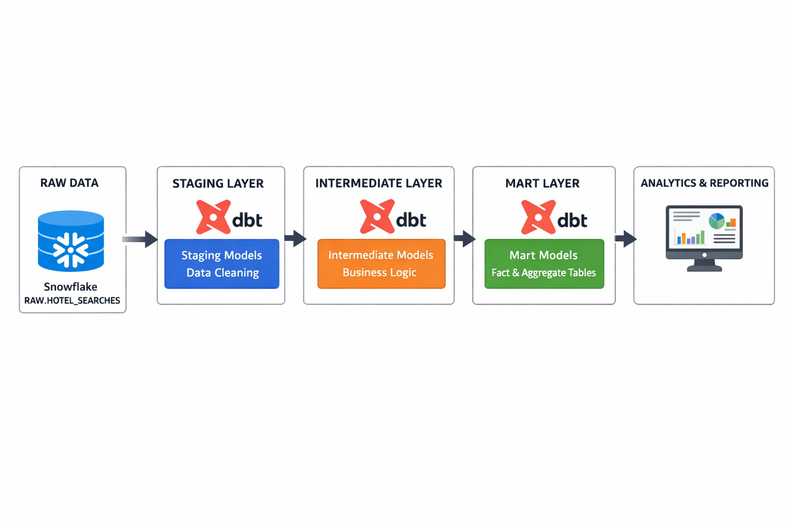

# 🏨 Hotel Search Analytics Project (dbt + Snowflake)

## 📌 Overview

This project demonstrates an end-to-end **analytics engineering workflow** using **Snowflake** and **dbt (data build tool)**.

It transforms raw hotel search event data into **clean, structured, and analytics-ready tables** to analyze user search behavior such as demand trends and popular destinations.

---

## 🧱 Architecture



```
Raw Data (Snowflake - RAW.HOTEL_SEARCHES)
        ↓
Staging Layer (dbt views)
        ↓
Intermediate Layer (business logic)
        ↓
Mart Layer (fact & aggregation tables)
        ↓
Analytics / Reporting
```

---

## ⚙️ Tech Stack

* **Snowflake** → Cloud Data Warehouse
* **dbt (CLI)** → Data Transformation
* **SQL** → Transformation logic
* **Git + GitHub** → Version Control

---

## 📂 Project Structure

```
models/
  staging/
    sources.yml
    stg_hotel_searches.sql

  intermediate/
    int_hotel_search_enriched.sql

  marts/
    fct_hotel_searches.sql
    agg_daily_searches.sql
    agg_top_destinations.sql

dbt_project.yml
README.md
```

---

## 📊 Data Flow

1. Raw hotel search data is stored in:

   ```
   HOTEL_SEARCH_ANALYTICS.RAW.HOTEL_SEARCHES
   ```

2. dbt transforms data through layers:

   * **Staging** → cleaning & standardization
   * **Intermediate** → derived fields (e.g., stay_nights)
   * **Marts** → business-ready tables

---

## 🔄 dbt Models

### Staging

* `stg_hotel_searches`

  * Cleans raw data
  * Standardizes text fields

### Intermediate

* `int_hotel_search_enriched`

  * Adds `stay_nights`
  * Applies business logic

### Marts

* `fct_hotel_searches` → Fact table
* `agg_daily_searches` → Daily trends
* `agg_top_destinations` → Popular cities

---

## ✅ Data Quality Tests

Implemented using dbt tests:

* `search_id` → **not null, unique**
* `destination_city` → **not null**
* `search_date` → **not null, unique**

Run tests:

```bash
dbt test
```

---

## 🚀 Setup & Installation

### 1. Create virtual environment

```bash
penv create dbt-env
penv activate dbt-env
```

### 2. Install dbt Snowflake

```bash
pip install dbt-snowflake
```

### 3. Initialize dbt project

```bash
dbt init hotel_search_project
```

---

## ❄️ Snowflake Setup

Run the following SQL:

```sql
CREATE DATABASE HOTEL_SEARCH_ANALYTICS;

CREATE SCHEMA RAW;
CREATE SCHEMA ANALYTICS;

CREATE TABLE RAW.HOTEL_SEARCHES (
    search_id VARCHAR,
    user_id VARCHAR,
    search_timestamp TIMESTAMP,
    destination_city VARCHAR,
    checkin_date DATE,
    checkout_date DATE,
    adults_count NUMBER,
    children_count NUMBER,
    rooms_count NUMBER,
    device_type VARCHAR,
    platform VARCHAR,
    results_count NUMBER
);
```

---

## ▶️ Running dbt

Run all models:

```bash
dbt run
```

Run specific model:

```bash
dbt run --select fct_hotel_searches
```

Run tests:

```bash
dbt test
```

---

## 📖 Documentation

Generate docs:

```bash
dbt docs generate
dbt docs serve
```

This provides:

* Data lineage graph
* Model dependencies
* Table descriptions

---

## 🎯 Key Learnings

* Structured data transformations using dbt
* Layered data modeling (staging → marts)
* Dependency management using `ref()`
* Source configuration using `source()`
* Data quality testing with dbt
* Snowflake-based analytics architecture

---

## 📌 Future Improvements

* Add incremental models
* Integrate S3 ingestion
* Add Airflow orchestration
* Build dashboard (Grafana / Metabase)

---

## 👩‍💻 Author

Darshini Selvanayagam
